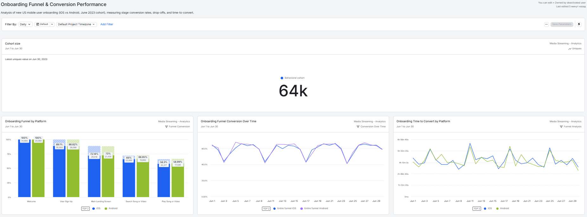
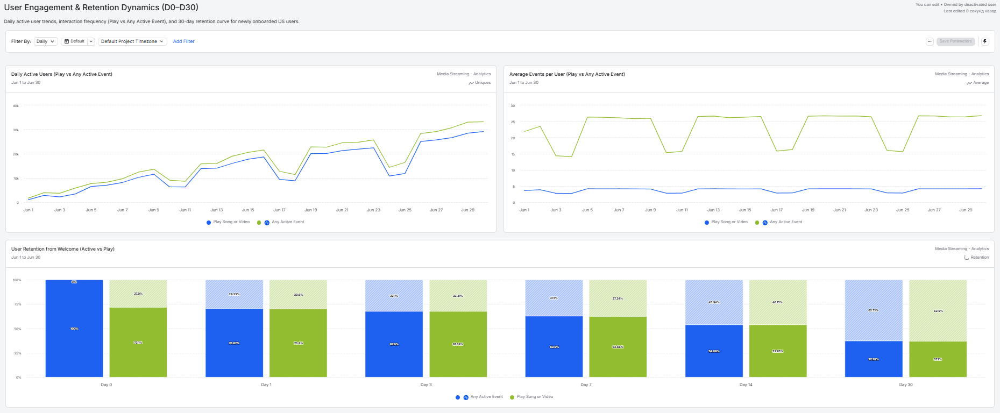

# 🎵 Media Streaming: Onboarding Funnel & User Retention Analysis in Amplitude

[](#)
[](#)
[](LICENSE)

## 📌 Executive Summary
This project delivers a comprehensive **Product & Behavioral Cohort Analysis** in **Amplitude** for a cross-platform (iOS & Android) media streaming platform operating in the United States. 

By isolating a high-intent new user cohort ($64\text{k}$ unique users who triggered the initial `Welcome` event in June 2023), this analytics solution investigates step-by-step onboarding friction, cross-platform conversion variances, time-to-first-value (`Play Song or Video`), and Day 0 through Day 30 retention dynamics to uncover actionable product growth opportunities.

---

## 🎯 Business Problem
* **Onboarding Friction & Drop-Off Points**: What is the overall and step-by-step conversion across the 5-step onboarding funnel (`Welcome` → `User Sign Up` → `Main Landing Screen` → `Search Song or Video` → `Play Song or Video`), and where is the steepest user loss?
* **Cross-Platform Parity**: How do conversion rates and conversion velocities differ between iOS and Android users?
* **Time to First Value (TTFV)**: How many hours does it take for newly acquired users to transition from app install to their first content stream?
* **Engagement & Retention Decay**: What proportion of onboarded users remain active over time, and what is the Day 0–30 retention curve for the core value action (`Play Song or Video`) versus general active usage (`Any Active Event`)?

---

## 🛠 Analytical Setup & Methodology
* **Tool**: Amplitude Analytics (`Media Streaming - Analytics`).
* **Target Cohort Definition**:
  * **Country**: United States
  * **Platforms**: iOS and Android
  * **Event Filter**: First-time `Welcome` execution during June 2023 (`Historical Count = 1`)
  * **Cohort Volume**: $64\text{k}$ unique users
* **Visualizations & Charts Built**:
  * Multi-step Ordered Funnel Conversion (Segmented by Platform)
  * Daily Funnel Conversion Trend (iOS vs. Android)
  * Daily Time to Convert (Hours to complete onboarding)
  * Daily Active Users (DAU) tracking `Play Song or Video` vs. `Any Active Event`
  * Average Events per User (Usage intensity over time)
  * User Retention Bar Chart (Day 0, 1, 3, 7, 14, 30 comparing `Play Song or Video` against `Any Active Event`)

---

## 🔍 Key Findings & Analytical Insights

| Metric / Funnel Step | iOS | Android | Key Takeaway |
| :--- | :---: | :---: | :--- |
| **Welcome → User Sign Up** | **89.10%** ($30\text{k}$) | **88.82%** ($26\text{k}$) | High initial sign-up intent across both platforms. |
| **User Sign Up → Main Landing** | **72.14%** ($25\text{k}$) | **73.00%** ($21.4\text{k}$) | **Primary Drop-off Area**: ~16% user loss during post-sign-up transition. |
| **Main Landing → Search** | **66.00%** ($22.8\text{k}$) | **66.95%** ($19.6\text{k}$) | Additional ~6% drop before search initiation. |
| **Overall Funnel Conversion** | **58.30%** ($20.2\text{k}$) | **58.99%** ($17.3\text{k}$) | Consistent conversion parity; Android slightly outperforms (+0.69%). |

* **Time to First Value Latency**: Time to complete onboarding averages between 3 to 6 hours (with periodic weekend/mid-month spikes reaching ~8 hours), indicating that a significant portion of users do not complete their first playback in their initial session.
* **Core Event vs. General Retention**:
  * **Day 0**: 72.10% of users play content on their initial day.
  * **Day 1**: 70.40% retention for content playback vs. 70.67% for any active event.
  * **Day 7**: 62.66% retention for content playback vs. 62.90% for any active event.
  * **Day 14**: 53.85% retention for content playback vs. 54.06% for any active event.
  * **Day 30**: 37.10% retention for content playback vs. 37.29% for any active event.
* **High-Intent Core Audience**: The negligible variance between `Any Active Event` and `Play Song or Video` retention confirms that retained users are active content consumers rather than passive browsers.

---

## 💡 Strategic Recommendations
1. **Reduce Post-Sign-Up Friction**: Address the 16% drop-off between `User Sign Up` and `Main Landing Screen` by streamlining post-registration onboarding steps, permissions, and initial load times.
2. **Instant Content Discovery**: Introduce personalized starter playlists and trending media directly on the `Main Landing Screen` to eliminate the mandatory `Search Song or Video` barrier, aiming to reduce median time-to-convert.
3. **Mid-Lifecycle Re-engagement**: Target users around Day 10–14 with curated digest notifications and algorithmic recommendations to stabilize retention above the 37% 30-day baseline.


---

## 📊 Project Structure
```text
├── LICENSE
├── README.md
└── images/
├── Onboarding_Funnel_Performance.png
└── User_Retention_Dynamics.png
```
---
## 📈 Visualizations & Dashboards

### 1. Onboarding Funnel & Conversion Performance


* **Cohort Size**: $64\text{k}$ unique US mobile users (June 2023).
* **Funnel Breakdown**: Step-by-step drop-off analysis comparing iOS and Android.
* **Conversion Over Time**: Daily conversion tracking showing stability across June.
* **Time to Convert**: Daily tracking of hours required to reach the first playback event.

---

### 2. User Engagement & Retention Dynamics (D0–D30)


* **Daily Active Users**: Active volume comparing core playback vs. total platform activity.
* **Average Events per User**: Usage frequency and consumption intensity trends.
* **Retention Dynamics**: Bar chart tracking retention decay across Days 0, 1, 3, 7, 14, and 30.

---
* 🔗 **Live Amplitude Dashboards**:
  * [Interactive Dashboard 1: Onboarding Funnel & Conversion Performance](https://app.amplitude.com/analytics/demo/dashboard/j06xwhwi)
  * [Interactive Dashboard 2: User Engagement & Retention Dynamics (D0–D30)](https://app.amplitude.com/analytics/demo/dashboard/f1hhq2h1)
---
## ✉️ Contact

**Author:** Oleksandr Hordashevskyi

- LinkedIn: [Oleksandr Hordashevskyi](https://www.linkedin.com/in/o-hordashevskyi/)
- Email: [o.hordashevskyi@gmail.com](mailto:o.hordashevskyi@gmail.com)
